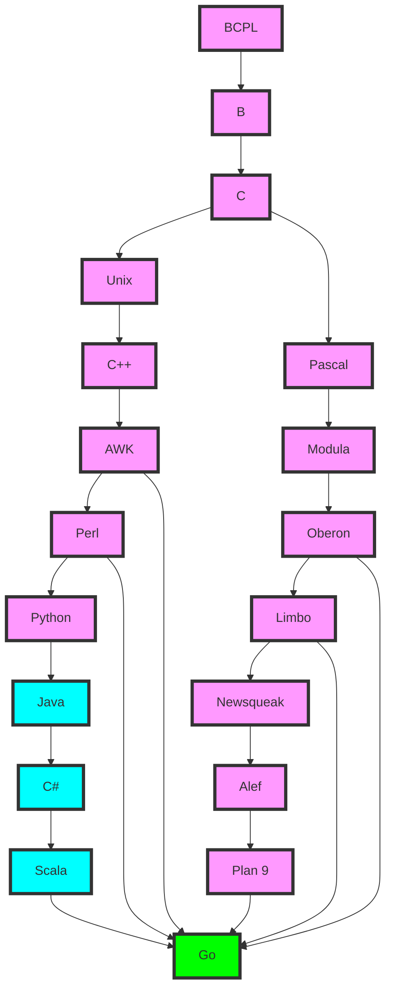

### Go 语言的血脉图表

 Go 语言血脉图表，以更清晰地展示 Go 语言的起源和影响。

为了展示 Go 语言的血脉，我们可以通过一张图表来说明其起源、设计者、受影响的语言以及 Go 语言对其他语言和工具的影响。

- **起源**：
  - BCPL、B、C 是 Go 语言的祖先语言，代表了早期的编程语言演变。
  - Unix、Pascal 等系统和语言对 C 和 C++ 的发展有重要影响。

- **演变过程**：
  - C++、AWK、Modula 等语言在 C 的基础上发展。
  - Perl 和 Python 等脚本语言简化了编程，提高了开发效率。
  - Java 和 C# 引入了面向对象编程和垃圾回收机制。
  - Squeak 和 Newsqueak 提供了并发编程的基础。

- **Go 语言的诞生**：
  - Go 语言吸收了前述语言的优点，设计出一种简洁、高效、内置并发支持的编程语言。

- **影响**：
  - Go 语言在云计算、容器化和微服务架构中得到了广泛应用，催生了许多重要的项目，如 Docker、Kubernetes、gRPC、etcd、Prometheus 等。
  - 这些项目进一步推动了云原生应用的发展，使 Go 语言成为现代软件开发的重要工具之一。

